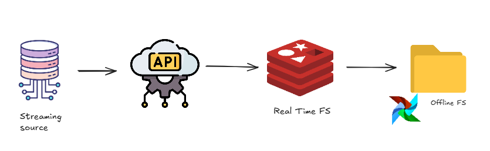
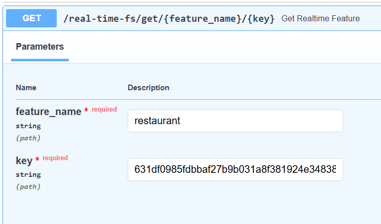
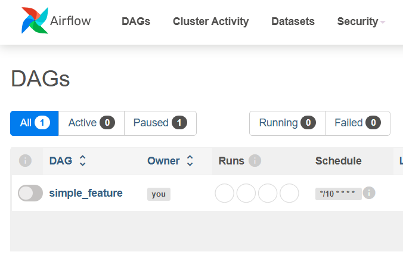
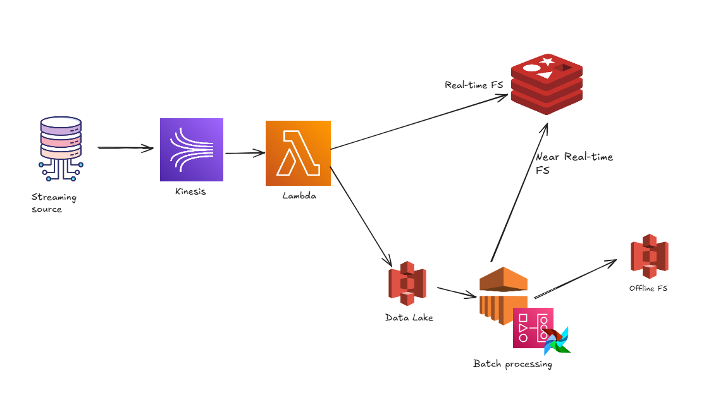

# IFood case

## 1. Feature Store Construction

In order to attend the online and offline requirement, I've created an API using FastAPI, integrated with a local Redis. I've also done a simple orchestration with airflow of a simple feature, just to illustrate how it would work for the offline FS.

The overall idea can be ilustraded as following

<p align="center">
  
</p>


For the API, inside folder **app/** , I've used a simple aplication of clean arcitecture.

```
.
├── main.py
└── src/
    └── entity/ #pydantic of input objects
    └── external/ #definition of connection to redis
    └── routing/ #declaration of routes for ingestion and Feature Store
    └── usecase/ #functions and logic for real time features and ingestion

```


### 1.1 Running the solution

#### Requirements 
- python 3.11+
- docker

---

Run on terminal

```
make build
```

Or if you don't have make intalled or code is running on windows 

```
docker compose up -d --build
```

Wait around 5 minutes for everything to build, checking logs if all containers have finished starting (specially airflow webserver)


To emulate a streaming scenario, I've created a file 'streaming_simulation.py' that reads data from given datasources on s3 and makes requests to the local api.

In order to populate Redis and have examples, you should do the following:

create local python venv


```
python3 -m venv venv
```

```
source venv/bin/activate (or on windows run venv\Scripts\activate) 
```
```
pip install -r requirements.txt
```

Next run on console 

```
python streaming_simulation.py
```

That will ingest the 4 datasources (limited to the number of rows declared on the file, currently 10) and also create the real-time feature `rtf_restaurant`, since it's populated by each time a new 'restaurant' event is registred.


Next, go to http://localhost:8000/docs. There you can find the swagger documentation for the API and also run some tests.

``` 
Note that all ingestions are identified by raw_{datasource_name}:id and real-time features rtf_{feature_name}:id
```


There you can find routes for the real-time FS based on redis and ingestion.

#### /real-time-fs/get/{feature_name}/{key}

This route retrieves the value of a real time feature.

Example:

<pre>

curl -X 'GET' \
  'http://localhost:8000/real-time-fs/get/restaurant/631df0985fdbbaf27b9b031a8f381924e3483833385748c8f7e1a41a6891d2b9' \
  -H 'accept: application/json'

</pre>


<p align="center">
  
</p>

Response:

<pre>
{
  "key": "631df0985fdbbaf27b9b031a8f381924e3483833385748c8f7e1a41a6891d2b9",
  "value": {
    "id": "631df0985fdbbaf27b9b031a8f381924e3483833385748c8f7e1a41a6891d2b9",
    "avg_ticket": "60.0"
  }
}
</pre>


#### /real-time-fs/list 

This FS rout lists avaiable features to read.


#### Ingestion


Also there are 4 endpoints for data ingestions - 1 for each data source.


On swagger docs, I've left examples that can be used to ingest new sources


####  Extra - Redis Debug

To make it easier to check what is stored locally on Redis, I've also made avaiable some simple redis endpoint. (Mostly to check the ingested data)

But it's important to note that **in a production enviroment that would not be avaiable.**

Example:

<pre>
curl -X 'GET' \
  'http://localhost:8000/getValues/raw_restaurant/631df0985fdbbaf27b9b031a8f381924e3483833385748c8f7e1a41a6891d2b9' \
  -H 'accept: application/json'
</pre>

Returns:

<pre>
{
  "key": "raw_restaurant:631df0985fdbbaf27b9b031a8f381924e3483833385748c8f7e1a41a6891d2b9",
  "value": {
    "id": "631df0985fdbbaf27b9b031a8f381924e3483833385748c8f7e1a41a6891d2b9",
    "created_at": "2017-01-20T13:14:48.286Z",
    "enabled": "true",
    "price_range": "3",
    "average_ticket": "60.0",
    "takeout_time": "0",
    "delivery_time": "0",
    "minimum_order_value": "30.0",
    "merchant_zip_code": "50180",
    "merchant_city": "SAO PAULO",
    "merchant_state": "SP",
    "merchant_country": "BR"
  }
}
</pre>

#### Offline FS

With previous steps ok, you should be able to run a simple offline/near real-time feature.

Go to http://localhost:8080, and use user admin with password admin to log in. 

There, a dag called 'simple_feature' should be avaiable with paused status. Enable it and wait for it's execution (should take a minute).

It reads the streamed data on redis and runs a simple aggregation, creating a parquet file that can be found on data/batch_results/simple_feature

<p align="center">
  
</p>


This dag runs every 10 minutes, emulating a 'near real time feature'. But if also serves as an example of a very simple offline feature store locally.


## 2 - AWS Architecture

<p align="center">
  
</p>

In order to make this process scalable on AWS, I'd suggest the above architecture.

### Kinesis

For better performance of consuming streaming data from multiple sources, a service like Kinesis would fit (or even  Kafka). Specially ifood, that deals with a huge volume of data.

### Lambda function & Redis + Data lake on S3

A lambda function could be used following the process, to apply necessary data transformations, and later store real-time features on Redis for later use.
But since it's also necessary to have a offline store, s3 could be used for storage in this case, creating a data lake. It would be even better to have a lake split in quality zones (bronze, silver, gold).

### EMR + Offline FS

EMR could be used to process offline features, orchestrated by airflow, doing more complex ETL with spark.
The final data than can be stored on s3, but it can also serve as a tool for near real-time features that require aggregations that would be too expensive to caculate real-time, later even storing it on Redis if nedeed.

### Extra: Cloudwatch and SNS

To make sure everything is working properly I'd also use Cloudwatch to log information from real-time ingestion, feature store and also information about dags runing on airflow.
SNS would complement it, by triggering alerts if something goes wrong, sending messages to a slack channel or email.


